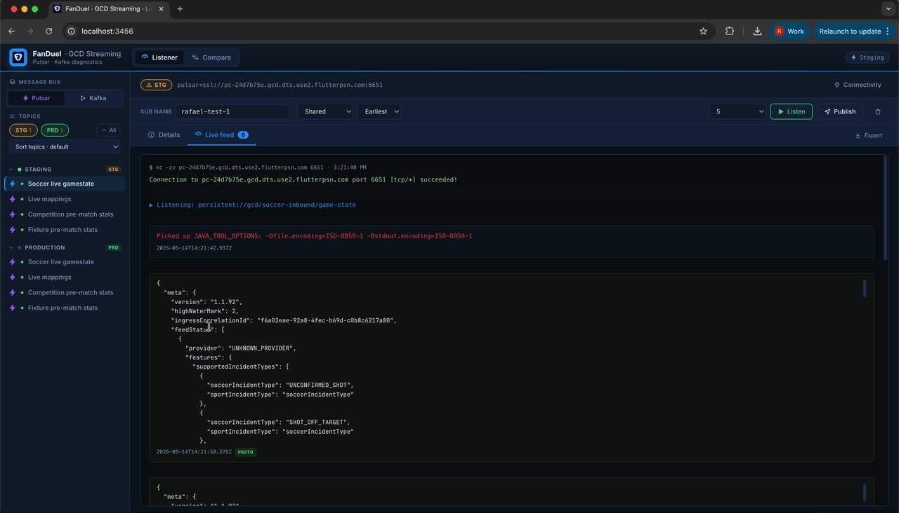
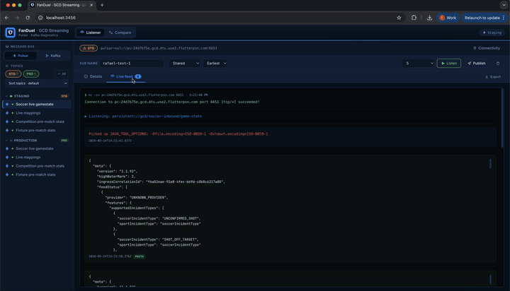
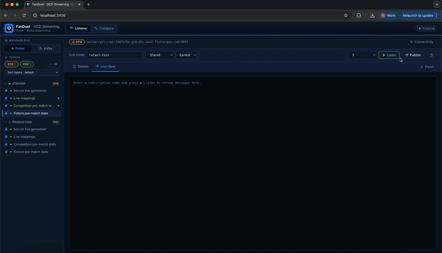
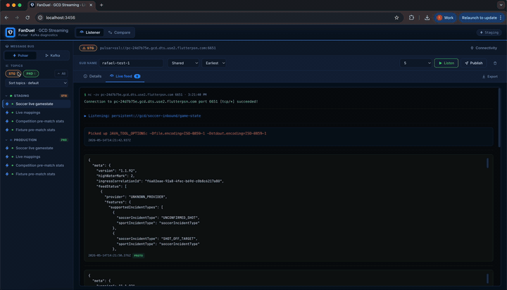
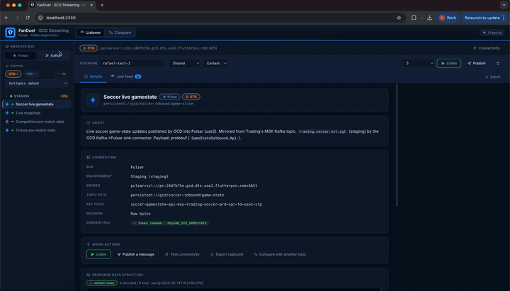
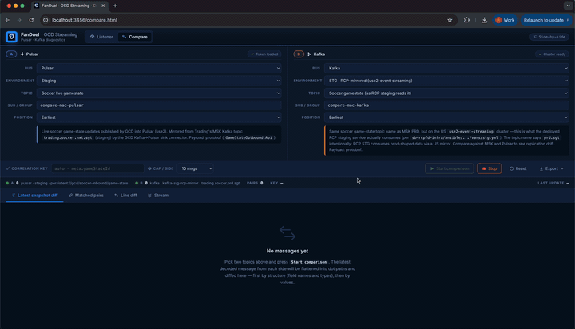
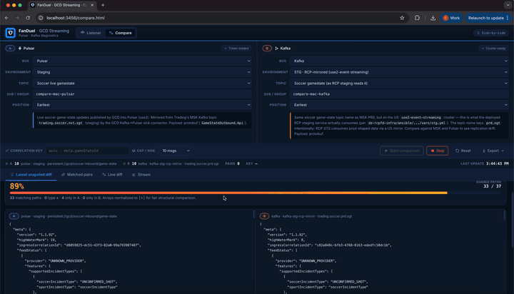
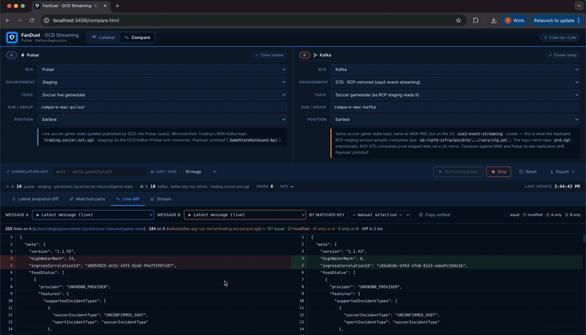
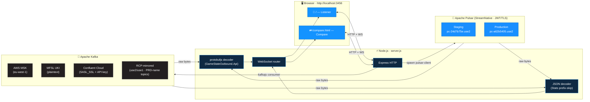

<!--
  README intentionally uses GitHub-flavored markdown features:
    • HTML in markdown for the centered hero banner
    • shields.io badges
    • Mermaid for the architecture diagram
    • <details>/<summary> collapsibles for deep-dive sections
    • GitHub-style alert callouts (> [!NOTE] / [!TIP] / [!WARNING])
  Renders cleanly on GitHub, Bitbucket Cloud, and most modern markdown viewers.
-->

<div align="center">


# GCD Streaming Client

### Pulsar + Kafka topic listener and side-by-side comparison tool

<sub>Internal FanDuel developer tool — not for distribution outside the company.</sub>

<br>

[](https://nodejs.org)
[](https://pulsar.apache.org)
[](https://kafka.apache.org)
[](https://expressjs.com)
[](https://kafka.js.org)
[](https://protobuf.dev)
[](#)
[](#)
[](#)

<br>

**Consume · Inspect · Compare · Export** — GCD topic messages across Pulsar & Kafka, from one local UI.

<br>

<a href="#-demo"><b>🎬 Demo</b></a> ·
<a href="#-quick-start"><b>🚀 Quick start</b></a> ·
<a href="#-features-at-a-glance"><b>✨ Features</b></a> ·
<a href="#%EF%B8%8F-architecture"><b>🏗 Architecture</b></a> ·
<a href="#-compare-page-comparehtml"><b>⇄ Compare page</b></a> ·
<a href="#-cluster-topology"><b>🗺 Cluster map</b></a> ·
<a href="#-export-formats"><b>📊 Exports</b></a> ·
<a href="#-troubleshooting"><b>🛠 Troubleshooting</b></a>

</div>

---

## 🎬 Demo

A two-and-a-half-minute walkthrough of the listener and compare pages — picking topics, streaming messages, filtering by environment, running a side-by-side diff, and exporting the comparison.

<!--
  On github.com/<repo>: the <video> tag below renders as an inline player
  (with the poster JPG as the click-to-play splash). Bitbucket / IDE preview
  / plain markdown viewers fall back to the poster , which is itself a
  clickable link to the MP4 on disk. Either way, no broken-image icon.

  Both `00-full-demo.mp4` (5.6 MB) and `00-full-demo-poster.jpg` (73 KB) are
  committed in media/clips/ and regenerated by ./media/make-clips.sh.
  The raw 188 MB ScreenRecording.mov is .gitignored — never pushed.
-->

<p align="center">
  <a href="./media/clips/00-full-demo.mp4">
    <video src="./media/clips/00-full-demo.mp4"
           poster="./media/clips/00-full-demo-poster.jpg"
           controls preload="metadata" muted playsinline
           width="880" style="max-width:100%;border-radius:8px;">
      
    </video>
  </a>
</p>

<p align="center">
  <sub>▶ <a href="./media/clips/00-full-demo.mp4"><b>Play full demo (5.6 MB · 2:26)</b></a> · the player above is inline on GitHub; click the poster anywhere else to open the MP4.</sub>
</p>

### 🎞 Feature highlights

Short, palette-optimised GIFs for each capability — they auto-play and loop inline on github.com. Click any GIF to jump to its higher-quality MP4 counterpart (handy for sharing in Slack/Jira). All seven scenes total ~45 MB committed in `media/clips/`.

<table>
<tr>
  <th width="50%">🎧 1. Pick a topic and listen</th>
  <th width="50%">🧭 2. Message structure & details</th>
</tr>
<tr>
  <td>
    <a href="./media/clips/01-pick-topic-and-listen.mp4">
      
    </a>
    <sub>Bus → env → topic → ▶ Listen. Decoded messages stream live.</sub>
  </td>
  <td>
    <a href="./media/clips/02-message-structure-and-details.mp4">
      
    </a>
    <sub>Details tab: connection info, decoder, live type-only tree preview.</sub>
  </td>
</tr>
<tr>
  <th>🗂 3. Sidebar — filter & sort</th>
  <th>⇄ 4. Compare — pick sources</th>
</tr>
<tr>
  <td>
    <a href="./media/clips/03-sidebar-filter-and-sort.mp4">
      
    </a>
    <sub>STG/PRD chips, A→Z sort, collapsible env groups — all persisted.</sub>
  </td>
  <td>
    <a href="./media/clips/04-compare-pick-sources.mp4">
      
    </a>
    <sub>Source A + Source B pickers, correlation key, cap, ▶ Start.</sub>
  </td>
</tr>
<tr>
  <th>📐 5. Structure vs values diff</th>
  <th>🆎 6. Side-by-side line diff</th>
</tr>
<tr>
  <td>
    <a href="./media/clips/05-compare-structure-and-values-diff.mp4">
      
    </a>
    <sub>Schema match score, type pills, filter chips, A-only vs B-only.</sub>
  </td>
  <td>
    <a href="./media/clips/06-side-by-side-line-diff.mp4">
      
    </a>
    <sub>VSCode-style red/green line diff with LCS pairing & copy-unified.</sub>
  </td>
</tr>
<tr>
  <th colspan="2">📤 7. Export menu — JSON · CSV · Markdown</th>
</tr>
<tr>
  <td colspan="2" align="center">
    <a href="./media/clips/07-export-menu.mp4">
      
    </a>
    <br>
    <sub>Three formats from the same state — topic-named JSON files, sectioned CSV, full Markdown report.</sub>
  </td>
</tr>
</table>

<details>
<summary><b>🔁 How to regenerate the demo assets</b></summary>

Every file the README references lives in `media/clips/` and is produced by `media/make-clips.sh`:

```sh
brew install ffmpeg            # one-time
./media/make-clips.sh          # rebuild: hero MP4 + poster + 7 feature MP4s + GIFs
./media/make-clips.sh --probe  # just print the source video's duration
./media/make-clips.sh --full-only / --clips-only / --mp4-only / --gif-only
```

The raw `media/ScreenRecording.mov` (~188 MB) is `.gitignored` — only the compressed clips and the poster ship with the repo. See **[`media/README.md`](./media/README.md)** for the full clip-tuning guide and the optional **`user-attachments` upgrade** for fully inline autoplay on GitHub.

</details>

---

## Overview

A local web tool for **consuming**, **inspecting**, **comparing**, and **exporting** messages from the FanDuel GCD topics — across **Apache Pulsar** (StreamNative, JWT) and **Apache Kafka** (AWS MSK, MFSL, Confluent Cloud, and the RCP-mirrored US clusters). Staging and production clusters are pre-configured to match the GCD city map and the deployed `sb-rcpfd-infra` Ansible vars.

The UI runs at **`http://localhost:3456`** and has two pages, both themed with the FanDuel brand (electric-blue accents on a dark dev-friendly canvas, Inter font, FanDuel shield favicon):

| Page | URL | Purpose |
|------|-----|---------|
| **Listener** | `/` | Pick a bus → environment → topic, subscribe, see decoded messages live, export them. |
| **Compare** | `/compare.html` | Open **two consumers in parallel** (any combination of Pulsar/Kafka) and explore the differences across four views: structure-and-values diff, matched pairs, **VSCode-style side-by-side line diff**, and raw stream. |

> [!NOTE]
> Designed for diagnostics, not production traffic. No data is persisted server-side.

---

## ✨ Features at a glance

<table>
<tr>
  <td width="50%" valign="top">

### 🎧 Live consumption
- 📡 **Pulsar** over TLS + JWT (StreamNative)
- 📨 **Kafka** on MSK / MFSL (PLAINTEXT) and Confluent (SASL_SSL)
- 🧪 **Connectivity probe** (`nc -zv`) per cluster
- ✉️ One-click **publish** to a Pulsar topic
- 🔄 State **persists across page navigation** (sessionStorage)

  </td>
  <td width="50%" valign="top">

### 🔍 Decoding & insight
- 🧬 Auto-decode **protobuf** `GameStateOutbound.Api`
- 📄 Auto-decode **JSON** with RCP's `StatsHandlerDeserializer` semantics
- 🧭 **Type-only tree** preview of the latest message structure
- 🏷 Topic descriptions disambiguate similarly-named topics
- 🟢/🔴 **Credential status dot** per topic in the sidebar

  </td>
</tr>
<tr>
  <td width="50%" valign="top">

### ⇄ Comparison engine
- 📐 **Structure** diff — fields & types only
- ⚖ **Values** diff — actual runtime values
- 🔍 **Both** — combined lens for power use
- 🎯 **Matched pairs** by correlation key (auto-detected or override)
- 🆎 **VSCode-style** line-by-line diff with LCS pairing
- 📊 **Schema match %** score with verdict bar

  </td>
  <td width="50%" valign="top">

### 📤 Export & sharing
- 📦 **JSON** — three topic-named files (`<topic>Response.json` × 2 + `comparison.json`)
- 📊 **CSV** — sectioned spreadsheet with topic-named columns, separate `FIELD_MAPPING` and `VALUE_COMPARISON` tabs, severity-sorted
- 📝 **Markdown report** — verdict + at-a-glance + categorised field mapping + matched pairs + legend
- 📋 **Copy unified diff** to clipboard

  </td>
</tr>
</table>

---

## 🏗 Architecture



- The **server** is a single `server.js` (Express + `ws`). Pulsar consumption shells out to the **`pulsar-client`** CLI for fidelity with operational tooling; Kafka uses **`kafkajs`** entirely in-Node.
- Each consumer streams raw bytes through the appropriate **decoder** (protobuf for `gamestate_api`, JSON-with-prefix for stats) and pushes the decoded payload to the browser over **WebSocket**.
- The browser keeps a per-topic ring buffer (capped, LRU-evicted) in **`sessionStorage`** so navigating between the listener and the compare page never drops your captured messages.

---

## 🚀 Quick start

> [!TIP]
> First time on this machine? Let the helper scripts do everything.

```sh
./setup.sh   # one-time: installs prerequisites, scaffolds tokens.sh, runs npm install
#            (open tokens.sh and paste your Pulsar JWTs when prompted)
./run.sh     # every other time: pre-flights, sources tokens.sh, starts the server
# open http://localhost:3456 (or /compare.html)
```

`./setup.sh` checks (and offers to fix, on macOS) every prerequisite — Node ≥ 18, npm, `pulsar-client` (Apache Pulsar CLI via Homebrew), Java, `nc` (netcat), the local `node_modules/`, and a populated `tokens.sh` with JWT-shaped values. `./run.sh` pre-flights the same things every launch and bails out **before** Node crashes if something's missing, pointing you back at `./setup.sh`.

<details>
<summary><b>📜 Prefer to drive it manually? &nbsp;(click to expand)</b></summary>

```sh
brew install node apache-pulsar openjdk
npm install
cp -n tokens.sh.example tokens.sh
# edit tokens.sh and paste your Pulsar JWTs (+ optional Confluent keys)
source tokens.sh && npm start
```

</details>

<details>
<summary><b>📋 All available scripts</b></summary>

| Command | What it does |
|---|---|
| `./setup.sh`        | Interactive first-run wizard — installs missing deps (Homebrew on macOS), scaffolds `tokens.sh` from the template, runs `npm install`. Exits `0` when fully green, `1` if you still need to edit `tokens.sh`, `2` on a hard failure (e.g. no Homebrew on macOS). |
| `./setup.sh --check`| Read-only diagnostic. Never installs anything — just reports the state of every prerequisite. Useful for CI or "is this clone ready?" sanity checks. |
| `./setup.sh --yes`  | Non-interactive — assumes "yes" to every install prompt. CI-friendly. |
| `./run.sh`          | Daily driver. Pre-flights the prerequisites, sources `tokens.sh`, then `exec`s `npm start`. Ctrl-C cleanly stops the server. |
| `./run.sh --skip-check` | Skip the pre-flight (advanced — you'll see raw Node errors if something is wrong). |
| `npm run setup`     | Alias for `./setup.sh`. |
| `npm run check`     | Alias for `./setup.sh --check`. |
| `npm run dev` / `npm run run` | Alias for `./run.sh`. |
| `npm start`         | Raw start — assumes prerequisites are already in place; no pre-flight. |

</details>

<details>
<summary><b>🔬 What <code>setup.sh</code> checks (and can fix)</b></summary>

| Prerequisite | How it's detected | Auto-installable on macOS? |
|---|---|---|
| Node.js ≥ v18 | `node -v` | ✅ `brew install node` |
| npm | `npm -v` | bundled with Node |
| `pulsar-client` CLI | `command -v pulsar-client` | ✅ `brew install apache-pulsar` |
| Java | `java -version` | ✅ `brew install openjdk` |
| `nc` (netcat) | `command -v nc` | ✅ usually pre-installed |
| `node_modules/` | directory present and `.package-lock.json` not older than `package-lock.json` | ✅ `npm install` |
| `tokens.sh` exists | file present | ✅ copied from `tokens.sh.example` |
| Pulsar JWTs populated | each `PULSAR_*` var looks like a JWT (`*.*.*`, ≥ 80 chars) once sourced | ❌ **only the human filling in the file can do this** — the script tells you exactly which vars are empty or malformed |

The script reports each check with a colored `✓ / ! / ✗`, ends with a one-line summary per check, and tells you precisely what's left to do. JWT *values* are never printed — only their names — so the output is safe to paste into a Slack thread.

</details>

---

## 📦 Prerequisites (macOS)

| Tool | Why | Install |
|------|-----|---------|
| 🍺 **Homebrew** | macOS package manager | <https://brew.sh> |
| 🟢 **Node.js v18+** | Server runtime | `brew install node` |
| 📡 **Apache Pulsar CLI** | Used for Pulsar consume/produce (parity with ops) | `brew install apache-pulsar` |
| ☕ **Java** | Transitively used by `pulsar-client` | `brew install openjdk` |
| 🔌 **`nc`** | Connectivity probes | preinstalled on macOS |

> [!NOTE]
> The Kafka side runs entirely in Node via `kafkajs` — no Kafka CLI required.

---

## ⚙️ Configuration

### 1) Install Node deps

```sh
npm install
```

Installs `express`, `ws`, `protobufjs`, and `kafkajs`.

### 2) Configure credentials

```sh
cp tokens.sh.example tokens.sh
# then edit tokens.sh and fill in what you have
```

<details>
<summary><b>🔑 Pulsar (StreamNative JWTs)</b> — required for any Pulsar topic you want to read</summary>

```sh
# Staging
export PULSAR_STG_GAMESTATE="…"
export PULSAR_STG_MAPPINGS="…"
export PULSAR_STG_COMP_STATS="…"
export PULSAR_STG_FIXTURE_STATS="…"

# Production
export PULSAR_PRD_GAMESTATE="…"
export PULSAR_PRD_MAPPINGS="…"
export PULSAR_PRD_COMP_STATS="…"
export PULSAR_PRD_FIXTURE_STATS="…"
```

</details>

<details>
<summary><b>🔑 Kafka — Confluent Cloud only</b> (MSK / MFSL / RCP-mirrored need no env vars)</summary>

```sh
export KAFKA_STG_CONFLUENT_API_KEY="…"
export KAFKA_STG_CONFLUENT_API_SECRET="…"
export KAFKA_PRD_CONFLUENT_API_KEY="…"
export KAFKA_PRD_CONFLUENT_API_SECRET="…"
```

</details>

> [!CAUTION]
> `tokens.sh` is gitignored — **never commit secrets**.

### 3) Run

```sh
source tokens.sh && npm start
```

Open <http://localhost:3456>. You should see `✓ Proto definitions loaded (gamestate_api)` in the server log — that confirms protobuf decoding is wired for soccer gamestate on both buses.

> [!WARNING]
> **Network reminder**: MSK and MFSL clusters typically require the corporate / UKI VPN. RCP-mirrored US clusters (`*.fndlsb.net`) may require a different network reach. Confluent Cloud is public and just needs the API keys.

---

## 🎧 Listener page (`/`)

Pick **Pulsar** or **Kafka** in the sidebar bus switch, then an environment and a topic.

<details>
<summary><b>🗂 Sidebar — filter, sort, collapse, identify</b></summary>

- The bus switch at the top is a Pulsar / Kafka segmented control. Topic items below are tagged with the matching bus icon (lightning bolt for Pulsar, stylised "K" for Kafka), so you can tell at a glance which bus a topic belongs to.
- **Environment filter chips** — two pill checkboxes (`STG` amber, `PRD` green) with live counts let you focus the list. Toggle either off to hide all envs of that type. Especially useful on Kafka, where you have ~8 environments: flip PRD off while you investigate staging, and the list halves. Toggling both off shows a friendly hint instead of nothing.
- **Sort topics** dropdown — `default | A→Z | Z→A`. Sorts topics *within* each visible environment by display label. Environment order itself always follows `config.json` / `kafka-config.json` order, so related clusters stay grouped (e.g. STG MSK, STG MFSL, STG RCP-mirror, STG Confluent in canonical pipeline order).
- **Collapse** — click any environment header (or the `↕ All` button) to collapse / expand. Per-bus collapse state is persisted across reloads.
- All preferences (filter chips, topic sort, collapse state) persist in `localStorage` (`gcdEnvFilters`, `gcdSidebarSort`, `gcdCollapsedEnvs`).
- Each topic row shows: bus icon · credential dot (green = loaded, red = missing) · label · live indicator while consuming.

</details>

<details>
<summary><b>📑 Main panel — Details tab vs. Live feed tab</b></summary>

Once you pick a topic, the main area shows two tabs:

- **Details** *(default)* — everything you need to understand the topic before listening:
  - **Header** with the topic label, bus tag (Pulsar / Kafka), STG/PRD badge, and the full topic path.
  - **About** — the topic description from `config.json` / `kafka-config.json`, with inline `code` formatting preserved.
  - **Connection** — bus, environment, broker URL, topic path, key field, decoder (e.g. `Protobuf · gamestate_api.proto · GameStateOutbound.Api` or `JSON (Stats deserializer …)`), credential status pill, and a `Pulsar mirror` row for Kafka topics that mirror from Pulsar (or vice versa).
  - **Quick actions** — `Listen` (switches to Live feed and starts consuming), `Publish` (Pulsar only), `Test connectivity` (TCP probe), `Export captured` (JSON dump of what you've captured so far), and `Compare with another topic` (deep-links to `/compare.html` with the current topic pre-loaded as **Source A**).
  - **Response data structure** — a live, type-only tree derived from the most recent decoded message: keys keep their names, values are replaced with their runtime type (`"string"`, `"number"`, `[…]`, etc.). Updates as new messages arrive.
- **Live feed** — the streaming console. Use the `Listen` button (controls bar or Details → Quick actions) to start; messages decode as protobuf or JSON depending on the topic's configured decoder, with a `proto` / `json` badge on each bubble.

The standalone `⬇ Export` button (top-right of the tab bar) and the controls bar (`▶ Listen`, `✉ Publish`, `🗑 Clear`) remain available regardless of which tab you're on.

</details>

<details>
<summary><b>📡 Pulsar flow</b></summary>

1. Bus → **Pulsar**, then env (`Staging` / `Production`) and topic (`Soccer live gamestate`, `Live mappings`, `Competition pre-match stats`, `Fixture pre-match stats`).
2. Enter a **Subscription name** (e.g. `local-yourname-test`), pick a **Subscription type** (Shared / Exclusive / Failover / Key_Shared), **Start position** (Latest / Earliest), and **message count** (or ∞).
3. **▶ Listen**. The feed shows decoded messages — gamestate is rendered as pretty-printed JSON via the bundled `.proto` files.
4. **🔌 Connectivity** runs `nc -zv broker port` for the current cluster.
5. **✉ Publish** opens a panel to send a one-off message (Pulsar only; server uses `pulsar-client produce`).
6. **⬇ Export** dumps the current feed to JSON (`pulsar-<env>-<topic>-<timestamp>.json`).

</details>

<details>
<summary><b>📨 Kafka flow</b></summary>

1. Bus → **Kafka**, then cluster (MSK / MFSL / Confluent / RCP-mirrored) and topic.
2. Enter a **Consumer group** id (think of it like a Pulsar subscription name — unique per user is fine, e.g. `local-yourname-compare`).
3. **Start position** Latest / Earliest, message count (or ∞).
4. **▶ Listen** / **⏹ Stop**, **🔌 Connectivity** (TCP check on the first `host:port` from the bootstrap list), **⬇ Export** JSON. Publish is intentionally disabled.

Sidebar dots indicate credential state per topic:

- **🟢 Green** — credentials loaded (Pulsar JWT exported, or Kafka cluster requires none / Confluent key is set).
- **🔴 Red** — credentials missing. For Pulsar, the missing env var is shown in the tooltip; for Confluent, both `KAFKA_<env>_CONFLUENT_API_KEY` / `…_SECRET` must be set.

</details>

---

## ⇄ Compare page (`/compare.html`)

The compare page opens **two independent WebSocket consumers** — one per side — and renders four views over the streams. The single-topic listener and the compare page can run side-by-side in different browser tabs without interfering.

Open it from the sidebar's **⇄ Compare topics** link or go directly to <http://localhost:3456/compare.html>.

### Picking sources

Each side (A and B) has its own pickers: **Bus**, **Env**, **Topic**, **Sub / group**, **Start position**. The defaults auto-pick Pulsar STG soccer gamestate for A and Kafka STG MSK soccer gamestate for B — the canonical *"is the Pulsar mirror equal to the Kafka source?"* question.

Above the views:

- **Correlation key (dot path)** — empty for auto (tries `meta.gameStateId`, `meta.gameStateMatchId`, `fixture.fixtureId`, `fixtureId`, `gameStateId`, `matchId`, `id` in order). Override with anything like `fixture.fixtureId`.
- **Cap / side** — how many messages each consumer takes before stopping (default 50, `∞` available).
- **▶ Start comparison** / **⏹ Stop** / **↻ Reset** / **⬇ Export**.

A live strip below shows: counts per side (with a blinking dot while consuming), matched-pair count, active correlation key, and last-update timestamp.

<details>
<summary><b>📐 Tab 1 — Latest snapshot diff</b></summary>

A two-step model for *"are these two messages the same?"*:

1. **📐 Structure** *(default)* — compares **field names and types only**. Array indices are normalized to `[*]` so two arrays of different lengths don't pollute the diff. Row types:
   - `OK` — path on both sides with the same type.
   - `Type ≠` — same path, different runtime types (e.g. `string` vs `number`).
   - `A only` / `B only` — path missing on the other side.
   - Cell values render as **type pills** (`string`, `number`, `boolean`, `object`, `array`, `null`).

2. **⚖ Values** — only paths present on both sides; compares actual values. Row types: `Equal` / `Differs`. Array indices preserved so you can see element-level drift.

3. **🔍 Both** — combined table for power use. All five row kinds: equal · differs · type ≠ · A only · B only.

**Schema match score** card stays visible above the snapshots — a percentage with a coloured bar (🟢 ≥ 95%, 🟡 ≥ 75%, 🔴 below), plus a count line like *"152 matching paths · 4 type ≠ · 19 only in A · 0 only in B."*. Computed from the Structure diff so it doesn't fluctuate with timestamps.

Filter chips at the bottom (per mode):
- **Structure**: `Type mismatches`, `A only`, `B only`, `Matching`.
- **Values**: `Different values`, `Identical values`.
- **Both**: all five.

</details>

<details>
<summary><b>🎯 Tab 2 — Matched pairs</b></summary>

Messages are grouped by the correlation key value. A "pair" appears when both sides have received a message sharing the same key. Each card shows the **schema match %** for the pair and the same mode-aware summary pills, then expands to the field table on demand. Most recent on top.

Useful for *"for fixture X across N updates, what consistently differs?"*.

</details>

<details>
<summary><b>🆎 Tab 3 — Side-by-side line diff (VSCode-style)</b></summary>

Pick any specific message from A and any from B, and see them line-by-line. Implementation is a proper LCS (longest common subsequence) line diff with adjacent del+add pairing — the same algorithm VSCode uses for its compare view.

- ⬜ **White / no highlight** — line identical on both sides.
- 🟥/🟩 **Red on left + green on right** — modified line (aligned at the same row).
- 🟥 **Red only** / 🟩 **green only** — line exists on only one side; the empty side shows a striped placeholder so the row alignment is obvious.
- **Numbered gutters** for both sides, scroll-synced because they share one grid.

Three ways to pick which two messages to compare:

1. **Manual** — the `Message A` and `Message B` dropdowns list every message received on that side, labelled like `#3 · 10:30:15 · meta.gameStateId=abc-123`.
2. **By matched key** — the third dropdown lists every correlation-key value where both sides have data. Pick a key and the two side pickers snap to that pair automatically.
3. **Live** — leave both on `▶ Latest message (live)` and the diff updates in real time as messages stream in.

**📋 Copy unified** writes a git-style unified diff to the clipboard, ready to paste into Slack / Jira / a PR. Messages over 2500 lines fall back to a naive zip diff with a "truncated" warning to keep the browser responsive.

</details>

<details>
<summary><b>🌊 Tab 4 — Stream</b></summary>

Raw per-side decoded message stream — proto for gamestate, JSON for prematch, latin1/hex fallback otherwise. Useful for sanity-checking what's actually arriving before reading too much into the diffs.

</details>

---

## 📊 Export formats

The **⬇ Export ▾** button (compare page) opens a dropdown with three formats. All three reflect the same underlying comparison state at the moment you click — they just package it differently for different audiences.

| Format | Output | Best for |
|--------|--------|----------|
| 📦 **JSON** | 3 files: `<topicLeafA>Response.json`, `<topicLeafB>Response.json`, `comparison.json` | Re-processing in scripts, attaching to JIRA, replaying messages, downstream diff tooling |
| 📊 **CSV** | Sectioned spreadsheet — `META` · `SUMMARY` · `FIELD_MAPPING` · `VALUE_COMPARISON` · `PAIR` | Spreadsheet analysis, pivot tables, stakeholders who prefer Excel, `awk`/`csvkit` pipelines |
| 📝 **Markdown** | Verdict + at-a-glance + categorised field mapping + matched pairs + legend + JSON appendix | Weekly write-ups, PR descriptions, Slack threads, JIRA tickets, anywhere markdown renders |

<details>
<summary><b>📦 JSON — three self-contained, topic-named files</b></summary>

A single click on **JSON** triggers **three** sequential downloads. The side files carry the actual topic name so the Downloads folder stays self-documenting; the comparison artefact uses a stable, short name so you can always find it. The browser shows a one-time *"this site wants to download multiple files"* consent banner on first use; accept it and future exports go through silently.

**Filenames:**

```
<topicLeafA>Response.json
<topicLeafB>Response.json
comparison.json
```

Where `<topicLeaf>` is the last meaningful segment of the topic name (Pulsar's `persistent://gcd/soccer-inbound/game-state` → `game-state`; Kafka's dotted `trading.soccer.nxt.sgt` stays as-is since it has no `/` segments). On the rare collision where both topics share the same leaf, the duplicate side gets a `<bus>-` prefix so the two downloads never overwrite each other.

**Concrete example** — Pulsar gamestate mirror vs. upstream Kafka:

```
game-stateResponse.json
trading.soccer.nxt.sgtResponse.json
comparison.json
```

**What each file contains:**

| File | What's inside | Use it when… |
|---|---|---|
| **`<topicLeafA>Response.json`** | Everything about Source A: identity (`source`), `messagesReceived`, `exportedAt`, the latest decoded message (`latest`), and the full session receive buffer (`stream`). | You only care about one side — replaying, schema-extracting, or feeding A's payloads into a downstream tool. |
| **`<topicLeafB>Response.json`** | Same shape, for Source B. | Same as above, but for the other side. |
| **`comparison.json`** | The cross-cutting analysis: `meta` (timestamp, correlation key, schema match %, both source identities, message counts), `diff` (structure / values / both for the latest snapshot), and `pairs` (each matched pair with its per-pair diff). Deliberately omits the raw streams — they already live in the two response files. | Sharing the *comparison result* with a reviewer or attaching to a ticket without dragging along the raw messages. |

If a side has no topic selected when you export, its filename falls back to `source-aResponse.json` / `source-bResponse.json` so the download still succeeds.

**Per-file shapes:**

```jsonc
// <topicLeafA>Response.json  (and analogous <topicLeafB>Response.json)
{
  "source":           { "bus", "env", "topic", "description" },
  "messagesReceived": 12,
  "exportedAt":       "2026-05-14T13:00:00Z",
  "latest":           { /* decoded latest message */ },
  "stream":           [ /* every message seen this session */ ]
}

// comparison.json
{
  "meta": { "exportedAt", "correlationKey", "schemaMatchPct", "sourceA", "sourceB", "counts" },
  "diff": { "structure": {…}, "values": {…}, "both": {…} },
  "pairs": [ { "key", "a": {ts, content}, "b": {ts, content}, "diff": {…} }, … ]
}
```

</details>

<details>
<summary><b>📊 CSV — sectioned spreadsheet with topic-named columns</b></summary>

Flat, sectioned tabular export — one row per field path, ready to open in Excel / Google Sheets / Numbers. Filename: `…-<ts>.csv`.

The four data columns (`Type [A]`, `Type [B]`, `Value [A]`, `Value [B]`) **carry the actual topic short-name in the header** — so you never have to guess *"is column E the Pulsar or the Kafka side?"*. E.g. `Type [game-state]`, `Value [trading.soccer.nxt.sgt]`. Long names cap at 40 chars; the full topic name still sits at the top of `META`.

**9 columns:**

| Section | Status | Severity | Path | Type [\<topicA\>] | Type [\<topicB\>] | Value [\<topicA\>] | Value [\<topicB\>] | Pair Key |
|---|---|---:|---|---|---|---|---|---|
| `META` | `SOURCE_A_TOPIC` |  |  |  |  | `persistent://gcd/.../game-state` |  |  |
| `META` | `SOURCE_B_TOPIC` |  |  |  |  |  | `trading.soccer.nxt.sgt` |  |
| `META` | `EXPORTED_AT` |  |  |  |  | `2026-05-14T13:00:00Z` |  |  |
| `SUMMARY` | `TYPE_MISMATCH` | `3` |  |  |  | `1` |  |  |
| `SUMMARY` | `MATCH` | `0` |  |  |  | `128` |  |  |
| `FIELD_MAPPING` | `TYPE_MISMATCH` | `3` | `meta.fixtureId` | `string` | `number` |  |  |  |
| `FIELD_MAPPING` | `ONLY_IN_B` | `2` | `kafkaOffset` |  | `number` |  |  |  |
| `FIELD_MAPPING` | `TYPE_MATCH` | `0` | `score.home` | `number` | `number` |  |  |  |
| `VALUE_COMPARISON` | `VALUE_DIFFERS` | `1` | `score.home` | `number` | `number` | `1` | `0` |  |
| `VALUE_COMPARISON` | `MATCH` | `0` | `meta.gameStateId` | `string` | `string` | `g-42` | `g-42` |  |
| `PAIR` | `TYPE_MISMATCH` | `3` | `meta.fixtureId` | `string` | `number` | `"42"` | `42` | `g-42` |

**Sections** (always in this order):

| Section | Lens | What it tells you |
|---|---|---|
| `META` | identification | Topic names pinned on rows 1–2 so the file is self-documenting after the header scrolls off. Also: timestamp, correlation key, schema match %, bus/env entries, descriptions, per-side message counts. |
| `SUMMARY` | counts | One row per status with its total count, plus `TOTAL_PATHS`. Severity column makes filter-and-sort trivial. |
| **`FIELD_MAPPING`** | **structural** | One row per field path showing whether the field exists on both sides and carries the same runtime type. Type columns populated, value columns blank. Status: `TYPE_MATCH` · `TYPE_MISMATCH` · `ONLY_IN_A` · `ONLY_IN_B`. Answers *"do both topics describe the same data?"*. |
| **`VALUE_COMPARISON`** | **values** | Only paths present on both sides with matching types — i.e. where a side-by-side value compare is meaningful. Type AND value columns populated. Status: `MATCH` · `VALUE_DIFFERS`. Excludes type-mismatches & only-in-A/B (those live in `FIELD_MAPPING`). Answers *"for the fields they share, are the values the same?"*. |
| `PAIR` | per-pair | Combined per-pair detail rows (structure + values together) for matched correlation keys. Pair key in last column. |

**Status vocabulary:**

| Status | Severity | Section | Meaning |
|---|---:|---|---|
| 🔴 `TYPE_MISMATCH` | `3` | `FIELD_MAPPING`, `PAIR`, `SUMMARY` | Same path on both sides, different runtime type — almost always a bug. |
| 🟠 `ONLY_IN_A` / `ONLY_IN_B` | `2` | `FIELD_MAPPING`, `PAIR`, `SUMMARY` | Structural drift — one side ships the field, the other doesn't. |
| 🟡 `VALUE_DIFFERS` | `1` | `VALUE_COMPARISON`, `PAIR`, `SUMMARY` | Same path & type, different runtime value (often expected). |
| ⚪ `TYPE_MATCH` | `0` | `FIELD_MAPPING` | Field exists on both sides with the same runtime type (says nothing about values — see `VALUE_COMPARISON`). |
| 🟢 `MATCH` | `0` | `VALUE_COMPARISON`, `PAIR`, `SUMMARY` | Path is fully equivalent (name + type + value). |

Within `FIELD_MAPPING`, `VALUE_COMPARISON`, and `PAIR`, rows are pre-sorted by **severity descending**, then by path A→Z. Open the file and the loudest fields are at the top — no spreadsheet wizardry required. Sort by `Severity` desc, or filter `Status != MATCH` / `Status != TYPE_MATCH` to hide noise. Long values truncate to 500 chars; quotes/commas/newlines properly escaped.

</details>

<details>
<summary><b>📝 Markdown report — human-readable, shareable</b></summary>

Detailed human-readable report. Filename: `…-<ts>.md`. Renders cleanly in Slack, GitHub, Bitbucket, Notion, Confluence — anywhere markdown is supported. Sections, top to bottom:

1. **Header** — generation timestamp, correlation key, matched-pair count.
2. **Verdict** — one of *✅ Schemas align* (≥95%), *⚠ Schemas mostly align* (≥75%), or *❌ Significant divergence*, plus a Unicode progress bar (`████████░░░░  50%`) showing the schema match %.
3. **At a glance** — a 6-row counter table (`✅ Match` / `≈ Value differs` / `⚠ Type mismatch` / `◧ Only in A` / `◨ Only in B` / `Total paths`) with a one-line definition for each outcome.
4. **Sources** — A and B side-by-side, comparing bus, environment, topic, message count, and the topic description.
5. **Field mapping (latest snapshot)** — the full mapping, categorised by outcome with one sub-section per status. Each table shows the field path, types, and values so the *what* and the *why* sit on the same row.
   - `⚠ Type mismatches` — path, type A, type B, value A, value B (highest signal — printed first).
   - `≈ Value differences` — path, value A, value B.
   - `◧ Only in Source A` and `◨ Only in Source B` — path, type, sample value.
   - `✅ Matches` — collapsed inside `<details>` so the report stays scannable for big payloads; expand to audit perfect matches.
6. **Matched pairs** — one card per pair. Each card carries a mini summary table (`Match / Differs / Type ≠ / A only / B only / Total`) plus a sorted list of *only* the non-matching rows for that pair. Pairs with no differences print `_Fully equivalent — no differences for this pair._` so they don't add noise.
7. **Snapshots** — pretty-printed JSON of the latest decoded message on each side.
8. **Legend** — a glossary that explains every icon and status used in the report, so a reader opening the document cold understands it without context.
9. **Appendix** — the full JSON export embedded in a fenced code block (equivalent to option 1).

</details>

---

## 🗺 Cluster topology

There are **three** valid Kafka entry-points for the same logical data, and `kafka-config.json` exposes all of them so you can pick the right comparison.

### Kafka

| Group of envs in the UI | Cluster | Role |
|---|---|---|
| `STG · MSK (…)` / `PRD · MSK (…)` | AWS MSK, `eu-west-1` (`mskgamestatenxt2…` STG / `mskgamestateprd1…` PRD), PLAINTEXT | 🎯 **GCD upstream** — what the Kafka→Pulsar sink connector reads from. Topic names: `trading.soccer.nxt.sgt` (STG), `trading.soccer.prd.sgt` (PRD). |
| `STG · MFSL` / `PRD · MFSL` | Internal MFSL, UKI (`ieX-mfsld00X-{nxt,prd}.betfair`), PLAINTEXT | Source for `livedata.mappings` (Kafka→Pulsar) and sink for `mappings.discovery` (Pulsar→Kafka, `euw1` connector). |
| `STG · Confluent` / `PRD · Confluent` | Confluent Cloud, `eu-west-1` (`lkc-zg6w6d…` / `lkc-195pyv…`), SASL_SSL + API key | Prematch stats source — STG topics are `trading.nxt.*`, PRD topics drop the `nxt.`. |
| `STG · RCP-mirrored (use2-event-streaming)` / `PRD · RCP-mirrored (use1-mfsfd)` | US-region internal Kafka used by the deployed **RCP** service (`sb-rcpfd-infra`) | 🔍 **What RCP actually consumes** — both envs use topic name `trading.soccer.prd.sgt` (STG override sets it back from the default `nxt.sgt`). Useful for a three-way comparison: RCP-view ↔ GCD-source ↔ GCD-Pulsar. |

### Pulsar

`use2` region for both STG and PRD; same topic paths in both:

| Logical | Topic | STG broker | PRD broker |
|---|---|---|---|
| Soccer live gamestate | `persistent://gcd/soccer-inbound/game-state` | `pulsar+ssl://pc-24d7b75e.gcd.dts.use2.flutterpsn.com:6651` | `pulsar+ssl://pc-a62b5405.gcd.prd.use2.flutterpsn.com:6651` |
| Live mappings | `persistent://gcd/livedata-inbound/livedata-mappings` | *(same broker)* | *(same broker)* |
| Competition pre-match stats | `persistent://gcd/soccer-inbound/competition-prematch-stats` | *(same broker)* | *(same broker)* |
| Fixture pre-match stats | `persistent://gcd/soccer-inbound/fixture-prematch-stats` | *(same broker)* | *(same broker)* |

### RCP deserializer alignment

This client decodes each payload the same way RCP does, so the **Compare** view is apples-to-apples:

- 🧬 **Gamestate** (`trading.soccer.*.sgt` and the Pulsar `game-state` mirror) → **protobuf** (`GameStateOutbound.Api`). Decoded when the topic has `schema: "gamestate_api"`.
- 📄 **Prematch stats** (`trading.*.prematch.stats` on Confluent and the Pulsar `*-prematch-stats` mirrors) → **JSON** with optional non-JSON prefix (RCP's `StatsHandlerDeserializer` skips bytes before the first `{`, then parses). Decoded when the topic has `valueFormat: "json"`.
- 🗺 **`livedata.mappings`** → **protobuf** (`MappingDeserializer` in RCP). The mapping `.proto` isn't bundled here yet, so those values surface as hex / lossy UTF-8 until the schema is added.

> [!IMPORTANT]
> The `rcp-service` codebase contains `application.properties` defaults pointing at `localhost:9092` and dev names like `SoccerTopic`; those are local/test only. The **`sb-rcpfd-infra` Ansible vars** (`vars/stg.yml`, `vars/prd.yml`) are the deployed truth and align with the tables above.

---

## 📁 Config files

| File | Purpose | Hot-reload? |
|---|---|---|
| `config.json` | Pulsar environments, broker URLs, topics, JWT env var names, optional `schema` per topic. | Server picks it up on next consume; restart for sidebar to refresh. |
| `kafka-config.json` | Kafka bootstrap brokers, SSL/SASL, topics, optional `pulsarMirror` hint, optional `schema` (proto) / `valueFormat` (`"json"`). | Same as above. |
| `tokens.sh` | Local-only env-var exports (Pulsar JWTs + Confluent keys). | Re-export and restart. |
| `tokens.sh.example` | Template; copy to `tokens.sh`. | — |

<details>
<summary><b>📝 Per-topic optional fields in <code>kafka-config.json</code></b></summary>

```jsonc
{
  "id":           "soccer_gamestate",
  "label":        "Soccer gamestate (GCD source)",
  "topic":        "trading.soccer.nxt.sgt",
  "pulsarMirror": "persistent://gcd/soccer-inbound/game-state",  // UI hint only
  "schema":       "gamestate_api",                               // triggers proto decode
  "valueFormat":  "json",                                        // triggers JSON-with-prefix decode
  "description":  "One- or two-sentence purpose of this topic. Backticks render as inline code."
}
```

`description` is rendered in the listener page (info strip + sidebar tooltip) and in the compare page (under each source's topic picker) so it's always clear *which* "soccer gamestate" you've selected when several similarly-named topics exist across clusters (MSK source, RCP-mirrored, etc.). The Pulsar `config.json` accepts the same field.

</details>

---

## 🛠 Troubleshooting

| Symptom | Likely cause / fix |
|---|---|
| 🔴 Red dot on a Pulsar topic, *"Token not set: PULSAR_…"* | The corresponding env var isn't exported. Edit `tokens.sh`, re-source it, restart the server. |
| 🔴 Red dot on a Confluent topic | `KAFKA_<env>_CONFLUENT_API_KEY` / `…_SECRET` missing. Set them and restart. |
| 🚫 Connectivity probe fails on MSK or MFSL | VPN is down or not the right one. MSK/MFSL hosts (`*.amazonaws.com`, `*.betfair`) need corporate / UKI VPN; RCP-mirrored hosts (`*.fndlsb.net`) may need a different reach. |
| ⏳ Kafka consumer hangs at *"▶ Listening"* | First TLS / DNS handshake over VPN can be slow; the client uses 60s connection timeout. Try **⏹ Stop** then **▶ Listen** again, or check the server console for `kafkajs` errors. |
| 🧪 Gamestate messages show as hex | Proto schema didn't load. Server log should say `✓ Proto definitions loaded (gamestate_api)` on startup; if not, run `npm install` (proto files are bundled under `game-state-api-master-api_outbound/`). |
| 📉 Compare page: schema match very low | Open the **Structure** tab and look at the `A only` / `B only` rows — usually a Pulsar message has extra envelope fields the Kafka decoded form doesn't, or one side hasn't received its first message yet. |
| ❓ `pulsar-client` not found at startup | `brew install apache-pulsar`, then either `eval "$(/opt/homebrew/bin/brew shellenv)"` or open a new shell. |

---

## 🙋 Requesting Confluent API access (copy-paste)

> Hi team — I'm running the local **GCD Streaming Client** to consume the Confluent Cloud prematch topics for diagnostics. MSK/MFSL/RCP-mirrored clusters work without extra creds, but Confluent needs **SASL_SSL + API key**. Could you provision or point me to **read-only API key + secret** for both clusters?
>
> - **STG**: cluster `lkc-zg6w6d-69eomp.eu-west-1.aws.glb.confluent.cloud:9092` — topics `trading.nxt.competition.soccer.prematch.stats`, `trading.nxt.fixture.soccer.prematch.stats`.
> - **PRD**: cluster `lkc-195pyv-69m5l5.eu-west-1.aws.glb.confluent.cloud:9092` — topics `trading.competition.soccer.prematch.stats`, `trading.fixture.soccer.prematch.stats`.
>
> I'll export them as `KAFKA_{STG,PRD}_CONFLUENT_API_KEY` / `…_SECRET` and restart the app. Happy to use a dedicated service account if that's easier. Thanks!

---

## 📁 Project layout

<details>
<summary><b>📂 Directory tree</b></summary>

```
PulsarWebClient/
├── 🟢 server.js                              # Express + WS; runs pulsar-client (Pulsar) and kafkajs (Kafka)
├── 📜 config.json                            # Pulsar envs/topics
├── 📜 kafka-config.json                      # Kafka envs/topics (MSK / MFSL / Confluent / RCP-mirrored)
├── 🔑 tokens.sh.example                      # Template for Pulsar JWTs and Confluent keys
├── 📦 package.json                           # Node deps (express, ws, kafkajs, protobufjs)
├── 🚀 setup.sh                               # One-time prerequisites wizard
├── 🚀 run.sh                                 # Daily-driver launcher with pre-flight
├── 🧬 game-state-api-master-api_outbound/    # Bundled gamestate outbound .proto files
├── 🌐 public/
│   ├── index.html                            # Listener page (single topic)
│   ├── compare.html                          # Compare page (two consumers, four views)
│   ├── shared.css                            # FanDuel design system (palette, navbar, buttons)
│   ├── icons.js                              # Inline SVG icon library
│   ├── fanduel-shield.png                    # Favicon + navbar brand icon
│   └── fanduel-wordmark.png                  # Full FanDuel lockup (kept for future use)
├── 🧪 test/
│   ├── export-smoke.js                       # CSV / Markdown / JSON export assertions
│   └── topic-state-persist-smoke.js          # sessionStorage cap + LRU eviction tests
├── 🎬 media/                                 # Demo recording + feature clip generator
│   ├── README.md                             # ffmpeg install, --flag inventory, user-attachments upgrade
│   ├── ScreenRecording.mov                   # Raw source — .gitignored (188 MB, rebuilds clips/)
│   ├── make-clips.sh                         # Slice the .mov into hero MP4 + per-feature MP4s + GIFs
│   └── clips/                                # ✅ Committed — what the README embeds (~50 MB total)
│       ├── 00-full-demo.mp4                  # Hero walkthrough (5.6 MB, played at top of README)
│       ├── 00-full-demo-poster.jpg           # Poster frame for the hero player
│       └── 0N-*.{mp4,gif}                    # Seven feature clips, used in the highlight grid
└── 💾 response/                              # Past JSON exports + reader guide
    ├── README.md
    ├── STAGING-CAPTURE-SUMMARY.md
    └── staging/*.json
```

</details>

---

<div align="center">

<sub>Built with 💙 for FanDuel · GCD Streaming · Pulsar + Kafka</sub>

<sub>Brand assets live in <code>public/fanduel-*.png</code> · Design system in <code>public/shared.css</code> · Accent color <code>#1493FF</code></sub>

</div>
